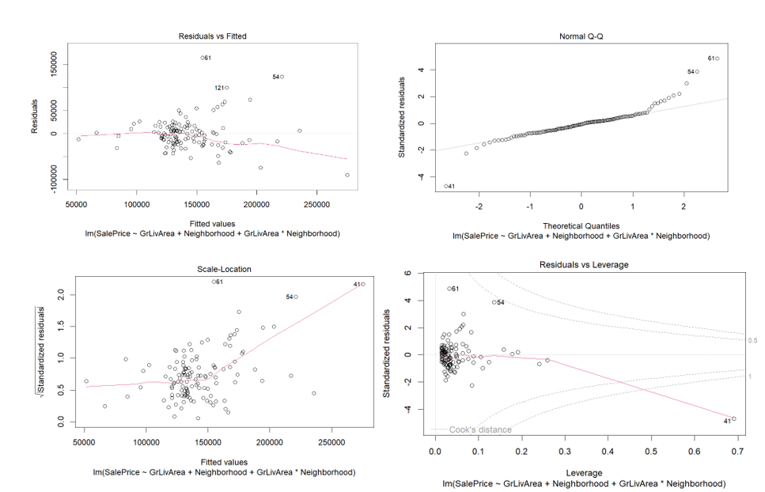
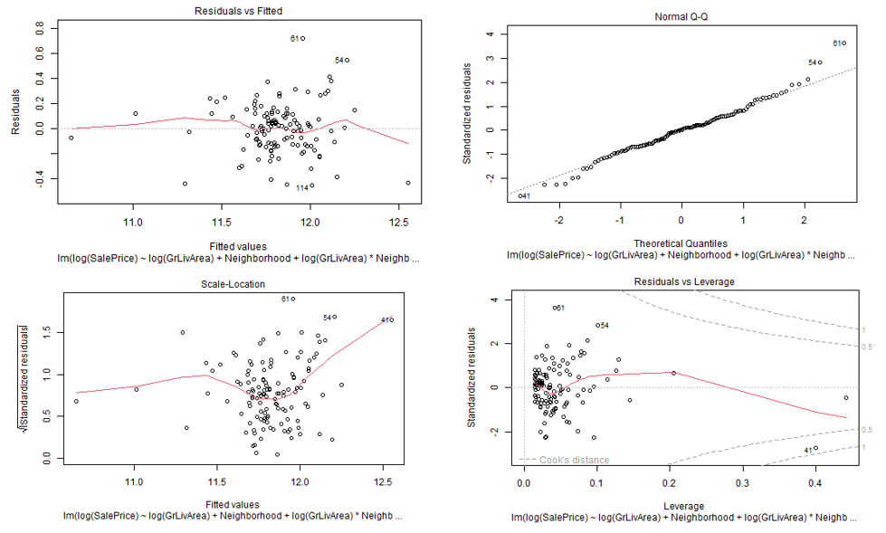
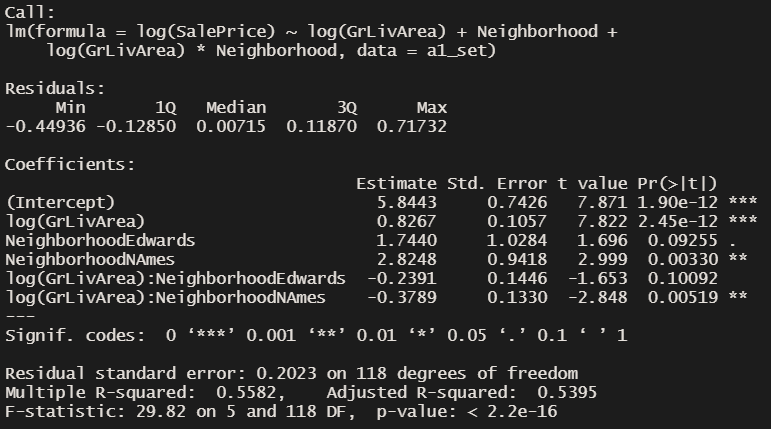
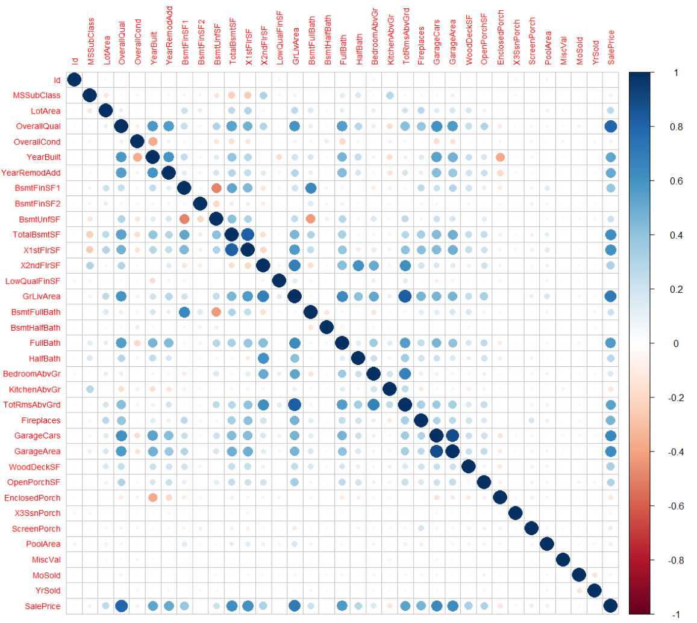
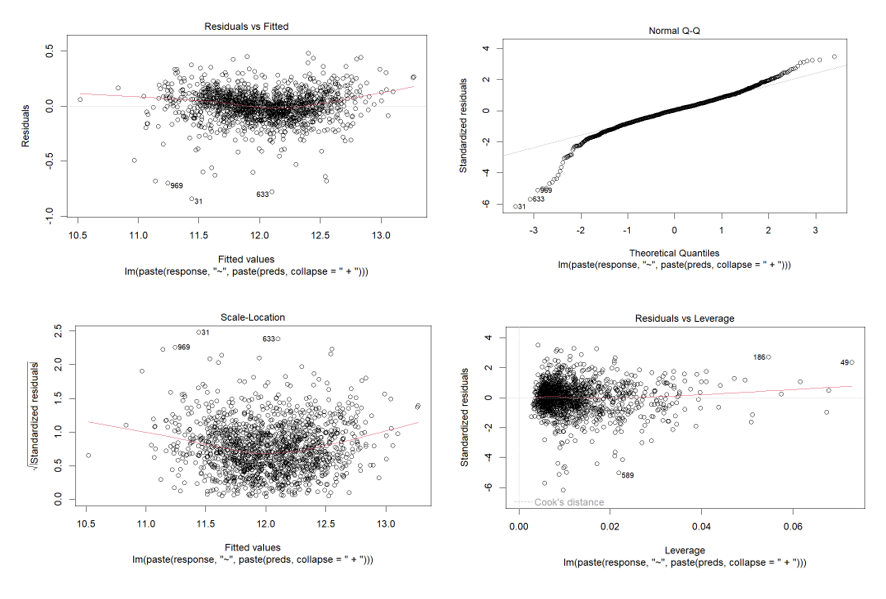

```{r include=FALSE}
library(tidyverse)
library(plotly)
library(car)
library(caret)
library(olsrr)
library(corrplot)
```
\graphicspath{ {./images/} }

\tableofcontents

\\

\textbf{Rshiny APP: https://carolinacraus.shinyapps.io/HousingApp/}

\setlength\parindent{18pt}
\section{Introduction}

For this project, we are provided a housing data set from the website Kaggle that contains a large collection of parameters that are likely to be correlated with the Sale Price of their respective houses. This dataset was built and provided by Century 21 Ames. Within this data set we find 81 parameters and 1460 rows, some of which must ultimately be used to build a predictive model to extrapolate housing prices given a certain set of these parameters. Key variables to take note are \textit{GrLIvArea} which is defined as \textit{Above ground living area}; \textit{Neighborhood}, which is the region that each house is from, and \textit{SalePrice}, which is the price that the house was sold for. 

The work for this project has been divided into two separate analyses; the first being the generation of a linear model to select and analyze parameters indicating significant correlation between the Sale Price of the houses and the locale that they are in, and the second being the generation of a rudimentary feature selection model using forward selection, backwards elimination, and stepwise selection to predict the prices of houses, whose predictions are ultimately graded by a Kaggle score.

\section{Analysis 1}

For the first analysis, we are commissioned out to analyze and estimate how the Sale Price of houses in Ames Iowa correlate to the square footage in the house, as well as any interactions that might be present with respect to the regions the houses are in. The scope of the analysis focuses primarily on houses within the neighborhoods of \textit{North Ames, Edwards, and Brookside}.

\subsection{Model Generation and Analysis}
To generate an initial model, we will look at a rudimentary approach to linear regression to see what our data does. Generating this model, seen in the Appendix results in the following residual plot.

```{r, echo=FALSE,fig.cap="Residuals for standard linear model"}

```


We can see from visualizations of the plotted model and residuals of the analysis that a transform of variables would greatly improve the quality of the model and associated residuals. Applying a log - log transform and visualizing again, we see: 

```{r, echo=FALSE,fig.cap="Residuals for transformed linear model"}

```

We find that the log-log transform has significantly reduced our residuals and given us a much better fit for the linear regression model, represented by bolstering our R^2 compared to the previous non-transformed model. We can see from the residual plots from the transformed fit that there are a few significantly high leverage/low residual points, and one out outlying point with a very high residual and leverage statistic. We can also verify from the adjusted $R^2$ and RMSE from each model that the transformed model fits the data much better than the a non-transformed model. 

We can also use these plots to analyse the assumptions for our linear model, from which we can see, after the log-log transform, there is not enough evidence to suggest a break in normality, visualized within the generated QQ plots, a statistically significant break in variance, visualized in the plot against both log-transformed variables, and that ... 

\subsection{Parameter Interpretation}

Within the following table, we can see the parameters that our output from our transformed model. From this model, we can pick out the parameter estimates, and analyze which ones are statistically significant and how our final model might look considering significance. 


```{r, echo=FALSE,fig.cap="Output Paramters of Model Summary", out.width= "60%",fig.align='center'}

```

In the table we can see the the parameters significance level, which provides a foundation for the interpretation for what each parameters value means in the scope of the linear model. It's also important to highlight that because the model was developed on a log-log transform model, parameters must be inverse-transformed to pull our their true values. 

The first parameter presented with statistical significance, is the intercept value at \textbf{5.8}. This means that, in the absence of all other variables the y-intercept of this linear model is $2^{5.8} = \textbf{55}$. This intercept has a \textbf{95 percent confidence interval of (20.67, 158)}.

Following that, we have the reference slope value of \textit{GrLivArea} or the total square ft. in each house. We can interpret this value as, we expect to see a $2^0.82$ = \textbf{1.76 multiplicative increase in median Sale Price per doubling of SqFt.}. We have a \textbf{95 percent confidence interval for this increase of (1.53,2.04)}.

The next two parameters are critical as they describe the change in the intercept associated by each region within the model. For this model, the region \textit{BrookSide} is set as the reference region and generates two different modified intercepts to potentially describe any variation that is associated with the presence of multiple regions in the model. From the table, we can pick out that change in intercept for region \textit{Edwards} is not statistically significant compared against a default confidence level of $\alpha = 0.05$, so it might not be relevant to include in the model, whereas the change in the intercept for the \textit{North Ames} region is statistically significant with a \textbf{p-value of 0.003}, indicating that it's inclusion in the model explains a significant amount of the variation within the selected dataset. More importantly, the interpretation of this parameter explains that between \textit{BrookSide} and \textit{North Ames}, assuming for this explanation a constant slope, we can expect to see \textbf{an increased shift in the median sale prices of houses of $e^{2.82} = 16.77$}. The 95% confidence interval for this increase is \textbf{(2.585,107.7)}

Finally, the last two parameters within the model are the change in slope that might occur due to interactions between GvLivArea and Neighborhoods. Of these two paramters, we can see that only the change in slope between \textit{BrookSide} and \textit{North Ames} is statistically significant. The interpretation indicates that, due to the log-log transform, for every doubling of our SqFt, we expect to see a $2^{0.826+(-0.378)} = 2^{0.448} = \textbf{1.38}$ \textbf{multiplicative increase in the Sale Price of houses within the North Ames region}. We can see that the estimated slope of data associated with the \textit{North Ames} region has a smaller slope than the \text{BrookSide} region, indicating the prices of houses in \textit{North Ames} increases at smaller rate compared to the reference. 

\subsection{Conclusion}

From a complete analysis of the parameters in the model, we can create a proper assessment of the different regions and how the pricing changes per region in the data. From the parameters, what we've gathered is houses that are typically in the N. Ames region start at higher pricing, but scale their pricing slower with respect to sq. ft. compared to houses that are within the Brookside region. Although the Edwards housing region has marginally varying statistics to the Brookside region, they are not statistically significant enough to indicate any explain any variation by themselves, and thus housing prices should follow the same trend. 


\section{Analysis 2}

For the second analysis in this project, we have been tasked to build a predictive model that predicts the salary of houses provided the parameters of the dataset. The scope of this prediction is more general than the previous analysis question, focusing on the entire state of Iowa. Ultimately, the goal of these prediction is to compete against a known set on the website \textit{Kaggle} to receive a Kaggle score, demonstrating how accurate our prediction are. 

\subsection{Model Selection and Generation}

Although we will be generating linear models for this analysis, the parameters for the model will be selected by a variety of selection methods, including, \textbf{forward selection, backwards elimination, and stepwise selection}. We will also be testing a set for which we select our own parameters to see how competitive we can get.

To generate the models, we must take an approach to limit the multicollinearity of the dataset, otherwise the selection models will not work. To do this, we can create a correlation plot of all the numeric values within the dataset, and visualize which values are highly correlated. 

```{r, echo=FALSE,fig.cap="Correlation Matrix"}

```

From this plot, we can eyeball the selection of highly correlated values, including \textit{"OverallQual, TotRmsAbvGrd, GarageCars, TotalBsmtSF, X1stFlrSF, X2ndFlrSF, FullBath"}. By removing these variables from the dataset, we reduce the colinearity of the set and allow for a better feature selection process. 

Running an initial backward selection model, we generate a series of residual plots that we can see below: 

```{r, echo=FALSE,fig.cap="Residuals for backwards elimination model"}

```

From the residual plots, we can see that due to the cloud-like random scattering of residuals, we've roughly explained the variations within the dataset with our model, this additionaly shows that there is no glaring breaks in variance. From the same plots, we can see that there is not sufficient evidence for any deviations from normality, seen in the QQ plots.We can additionalyly look at the VIFs for each model to numerically confirm that multicollinearity has been accounted for, with all numerical values falling below 3.

\subsection{Comparing Competing Models}

The following is the Results Table, from which we can analyze core components of each selection model: 

\begin{center}
\begin{tabular}{ |c|c|c|c| } 
 \hline
 Predictive Models & Adjusted R2 & CV PRESS & Kaggle Score \\ 
 \hline
 Forward & 0.8805 & 28.09 & 0.20061 \\
 \hline
 Backward & 0.8812 & 28.12 & 0.20061 \\
 \hline
 Stepwise & 0.8805 & 28.22 & 0.1814 \\
 \hline
 Custom & 0.846 & 38.28 & 0.20293 \\
 \hline
\end{tabular}
\end{center}

For the models, we restricted paramter selection to only numeric and limited coorelated parameters. This initial approach led to competitive and interesting Kaggle scores. However, our custom approach intended on adding categorical variables to identify more interactions. Our initial approach seemed to lower our Kaggle score, so we didn't pursue that specific model more than what we had. 

Ideally we believe that a proper execution of adding in categorical variables to the selection pool should result in a decreased Kaggle Score. 


\subsection{Conclusion}

  For Analysis 2, we were required to create 4 prediction models that, that atleast somewhat accurately predicted the sale price of houses sold within the Ames Iowa region. To use the data, we had to address issues of outliers and multicollinearity within the dataset, and narrowed our functional dataset to only numerical values. Using forwards selection, backwards elimination, stepwise selection, and our own custom selected parameter approach, we generated mildly competitive prediction results with Kaggle scores of \textbf{0.20061, 0.20061, 0.1814, 0.20293}, respectively. For the custom approach, although we did not see large gains, we believe that the approach of introducing categorical variables can be successful and should be studied more, for a more thorough model. 

\newpage

\section{Appendix}

\subsection{Useful Functions}

```{r RMSE function}
ModelRMSE <- function(res){
  retRMSE <- sqrt(mean(res^2))
  return(retRMSE)
}
```


```{r CVPress function}
CVPress <- function(input_model){
  pred_res = resid(input_model)/(1 - lm.influence(input_model)$hat)
  press <- sum(pred_res^2)
  return(press)
}
```


\subsection{Code for generating linear model}

```{r echo = TRUE, results = 'hide', fig.show= 'hide', warning=FALSE}


housing = read.csv(file = "train.csv")
test_housing = read.csv(file = "test.csv")
numeric_housing = housing %>% select_if(is.numeric)
#pull dataset into R, select paramters for A1.
a1_set = housing %>% select(SalePrice, Neighborhood, GrLivArea) %>%
  filter( Neighborhood == c("NAmes", "Edwards", "BrkSide")) 
#initial naive model, no transform
fit <- lm(SalePrice ~ GrLivArea + Neighborhood + GrLivArea*Neighborhood, data = a1_set) 

summary(fit)

#----------------

#transformed model to improve residuals and assumptions
fit_transform <- lm(log(SalePrice) ~ log(GrLivArea) + Neighborhood +
                      log(GrLivArea)*Neighborhood, data = a1_set) 


summary(fit_transform)
confint(fit_transform)


ModelRMSE(fit$residuals) #RMSE value of 33802
ModelRMSE(fit_transform$residuals) # RMSE Value of 0.1973


# Internal CV Press of Models: 

train.control1 = trainControl(method = "cv", number = 10)
model1 <- train(SalePrice ~ GrLivArea + Neighborhood + GrLivArea*Neighborhood, data = a1_set, method = "lm", trControl = train.control1)
#CVPress(model1$model) # doesn't work atm

```

\subsection{Code for generating selection model}

```{r echo = TRUE, results = 'hide', fig.show= 'hide'}
fit_numeric = lm(SalePrice ~., data = housing %>% select_if(is.numeric))
transformed_numeric = numeric_housing
transformed_numeric$SalePrice = log(transformed_numeric$SalePrice)
transformed_numeric$LotArea = log(transformed_numeric$LotArea)
t1 = subset(transformed_numeric, select = -c(LotFrontage, MasVnrArea, GarageYrBlt,
                                             OverallQual, TotRmsAbvGrd, GarageCars,
                                             TotalBsmtSF, X1stFlrSF, X2ndFlrSF, FullBath ))

corrplot(cor(t1)) #visualize correlation to identify which plots are correlated.
#After elimiation, it should be fairly sparsely correlated. 

t1fit = lm(SalePrice ~. , data = t1)

#the p-values for these should be fiddled with, 
backt1 = ols_step_backward_p(t1fit, prem = 0.05, details = FALSE)
forwardt1 = ols_step_forward_p(t1fit, penter = 0.05, details = FALSE)               
stepwiset1 = ols_step_both_p(t1fit, pent = 0.05, prem =0.05, details = FALSE)

#---------------------------------Summary Stats of the produced RL sets
summary(backt1$model)
vif(backt1$model)

ModelRMSE(backt1$model$residuals)
CVPress(backt1$model)
#---------------------------------
summary(forwardt1$model)
vif(forwardt1$model)

ModelRMSE(forwardt1$model$residuals)
CVPress(forwardt1$model)
#---------------------------------
summary(stepwiset1$model)
vif(stepwiset1$model)

ModelRMSE(stepwiset1$model$residuals)
CVPress(stepwiset1$model)

# build predictions from set: 

#since the original dataset is transformed, the testset needs to be transformed
#as well to account for the change in base.
test_housing$LotArea = log(test_housing$LotArea)

#--------------------------------------------- Backwards Elimination Prediction: 

back_pred = predict(backt1$model, test_housing) 

#Since the original dataset was transformed, we need to counter-transform to reobtain the
#untransformed data. 

real_bp = exp(back_pred)

#combine with ID and export as .csv

real_bp_joined = data.frame(test_housing$Id, real_bp)
colnames(real_bp_joined) = c("Id", "SalePrice")
#if there are any NA, set them to arbitrary 10k price. 
real_bp_joined[is.na(real_bp_joined)]<-10000 


write.csv(real_bp_joined, "./Kaggle_backt1_testset.csv", row.names = FALSE)

#-------------------------------------------- Forwards Selection Prediction: 

forward_pred = predict(forwardt1$model, test_housing)
real_forward = exp(forward_pred)
real_fp_joined = data.frame(test_housing$Id, real_forward)
real_fp_joined[is.na(real_fp_joined)]<-10000
colnames(real_fp_joined) = c("Id", "SalePrice")
write.csv(real_bp_joined, "./Kaggle_forwardt1_testset.csv", row.names = FALSE)

#-------------------------------------------- Stepwise Selection Prediction: 

stepwise_pred = predict(stepwiset1$model, test_housing)
real_step = exp(stepwise_pred)
real_sp_joined = data.frame(test_housing$Id, real_step)
real_sp_joined[is.na(real_sp_joined)]<-10000
colnames(real_sp_joined) = c("Id", "SalePrice")
write.csv(real_sp_joined, "./Kaggle_stepwiset1_testset.csv", row.names = FALSE)

## Custom Model: # Change categorical values to numeric
housing2 = housing
housing2$Neighborhood <- as.numeric(factor(housing2$Neighborhood,
                                                        levels = c("Blmngtn", "Blueste", "BrDale"),
                                                        labels = c(2,1,0), ordered = TRUE))
housing2$LotConfig <- as.numeric(factor(housing2$LotConfig,
                                                        levels = c("Inside", "Corner", "CulDSac", "FR2", "FR3"),
                                                        labels = c(4,3,2,1,0), ordered = TRUE))
housing2$ExterQual <- as.numeric(factor(housing2$ExterQual,
                                                        levels = c("Ex", "Gd", "TA", "Fa", "Po"),
                                                        labels = c(4, 3, 2,1,0), ordered = TRUE))
housing2$BsmtQual <- as.numeric(factor(housing2$BsmtQual,
                                                        levels = c("Ex", "Gd", "TA", "Fa", "Po"),
                                                        labels = c(4, 3, 2,1,0), ordered = TRUE))


normal_housing = housing 
normal_set = normal_housing %>% select(SaleCondition) %>% filter( SaleCondition == c("Normal"))
normal_housing = normal_housing %>% select_if(is.numeric)
normal_housing$SalePrice = log(normal_housing$SalePrice)
normal_housing$GrLivArea = log(normal_housing$GrLivArea)

t2 = subset(normal_housing, select = -c(LotFrontage, MasVnrArea, GarageYrBlt, OverallQual, TotRmsAbvGrd, GarageCars, TotalBsmtSF, X1stFlrSF, X2ndFlrSF, FullBath )) 
#removal of largely correlated values to reduce multicollinearity (VIF /approx 1) and actually allow back-elimination to run,
#it wasn't running without a ton of errors without this. 
corrplot(cor(t2)) #visualize correlation to identify which plots are correlated. After elimiation, it should be fairly sparsely correlated. 
t2fit = lm(SalePrice ~. , data = t2)
backt2 = ols_step_backward_p(t2fit, prem = 0.05, details = FALSE)
forwardt2 = ols_step_forward_p(t2fit, penter = 0.05, details = FALSE)               #the p-values for these should be fiddled with, 
stepwiset2 = ols_step_both_p(t2fit, pent = 0.05, prem =0.01, details = FALSE)
forwardt2
backt2
stepwiset2
#mystery4thsetWIP
#---------------------------------Summary Stats of the produced RL sets
summary(backt2$model)
vif(backt2$model)
ModelRMSE(backt2$model$residuals)
CVPress(backt2$model)
#---------------------------------
summary(forwardt2$model)
vif(forwardt2$model)
ModelRMSE(forwardt2$model$residuals)
CVPress(forwardt2$model)
#---------------------------------
summary(stepwiset2$model)
vif(stepwiset2$model)
ModelRMSE(stepwiset2$model$residuals)
CVPress(stepwiset2$model)
```
  
